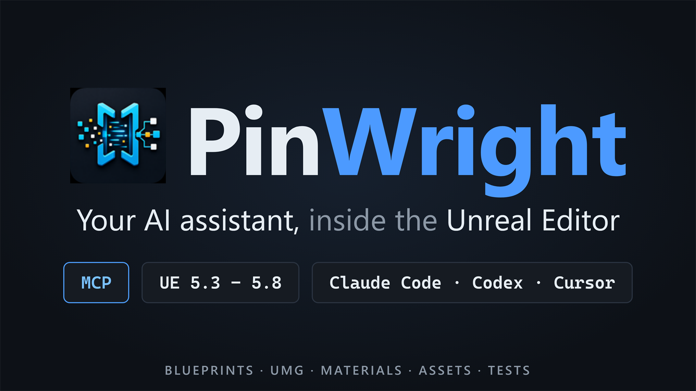

# PinWright support

Support tracker for the **PinWright** Unreal Engine plugin (formerly Editor Automation RPC Gateway).

**[Get PinWright on Fab](https://www.fab.com/listings/d9caf916-e5cf-435e-ab0e-a74cb8dcb253)** · **[Download the free demo](https://github.com/PinWright/pinwright-ue-support/releases/latest)** · **[Documentation](https://pinwright.com)**

There is no plugin source in this repository. It is where support happens, and it is the only support channel.

## Try the free demo

The free demo edition ships on the **[latest release](https://github.com/PinWright/pinwright-ue-support/releases/latest)** - one Windows zip per Unreal Engine version (5.3 through 5.8). Unzip the `PinWright` folder into your project's `Plugins\` directory (or the engine's `Plugins\Marketplace\`), enable it, and connect your agent from the in-editor **PinWright Setup** screen. The demo allows 200 project-changing calls per day; read-only calls are unlimited. The [full version on Fab](https://www.fab.com/listings/d9caf916-e5cf-435e-ab0e-a74cb8dcb253) has no cap and includes source.

## Where to report

| What | Where |
|---|---|
| A bug, or a critical gap in an existing feature | [Open an Issue](https://github.com/PinWright/pinwright-ue-support/issues/new?template=bug_report.yml) |
| A feature idea | [Discussions → Ideas](https://github.com/PinWright/pinwright-ue-support/discussions/new?category=ideas) (votable) |
| An install or usage question | [Discussions → Q&A](https://github.com/PinWright/pinwright-ue-support/discussions/categories/q-a) |

## Filing a good bug report

Include the plugin version (the `VersionName` in the `.uplugin`), your Unreal Engine version and OS, a minimal reproduction, and what you expected versus what happened. If you have a theory about the root cause, keep it separate from what you actually observed.

If you use the plugin through an AI coding agent, the agent can write the report for you and open a prefilled submission form. It never submits anything on its own; you review it and press submit.
